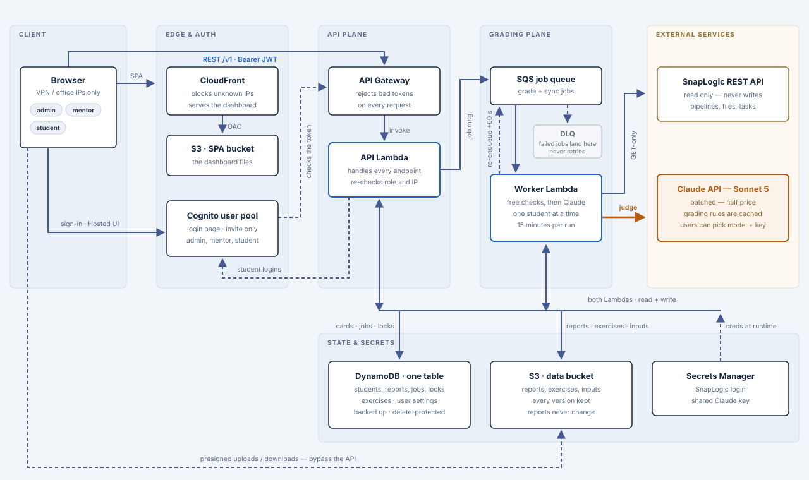

# SnapLogic Exercise Evaluator

A cloud-hosted grading platform for SnapLogic training exercises. Mentors open a
web dashboard, tick a student, and click **Grade**. A job in AWS pulls the
student's pipelines from SnapLogic, runs deterministic checks against the
solution, and hands whatever survives to Claude for scoring.

I built it because these exercises have many valid solutions, so a fixed rubric
never fit. The deterministic part answers "did it work", and the model answers
"was it built well".

Everything runs in AWS. There is nothing to install to use it.

Solid lines are the request and data path, dashed lines are secondary paths
(dead-letter, the delayed collect message, credential reads, presigned
transfers), and the amber line is the only paid AI call. The horizontal line
across the state plane is a shared bus: both Lambdas read and write DynamoDB and
S3 and read Secrets Manager. Every box is Terraform-managed under `infra/`.

A full grading run is two-phase, which is why the worker has an arrow back to
the queue: it submits every exercise as one Message Batches request, re-enqueues
a `collect` message on a 60-second delay, and finalizes the report once the batch
has ended. Single-task regrades take the synchronous path instead.

## Table of Contents

\- [Prerequisites](#prerequisites)  
\- [File Structure](#file-structure)  
\- [What I Used](#what-i-used)  
\- [How Grading Works](#how-grading-works)  
\- [Using the Dashboard](#using-the-dashboard)  
\- [Managing Exercises](#managing-exercises)  
\- [Deployment](#deployment)  
\- [Notes](#notes)  

## Prerequisites

**Accounts & Services**:
- AWS Account (everything is deployed here, around $0.50-0.70/month at this scale)
- Anthropic API Key (pays for the AI judging)
- SnapLogic Org with an admin login that can read both the solution and the student project spaces
- GitHub Repository (CI/CD authenticates through OIDC, so there are no stored keys)

**Deployment Tools**:
- AWS CLI
- Terraform CLI
- Docker (the Lambdas are container images, and the first one has to be pushed by hand)

**Values you need on hand** (these go into Secrets Manager and Terraform variables):
- `SNAPLOGIC_BASE_URL`, admin username and password
- `SNAPLOGIC_ORG_NAME`: the top-level org, first segment of every lookup
- `SNAPLOGIC_SOLUTION_PROJECT_SPACE` and `SNAPLOGIC_SOLUTION_PROJECT`: where the solution pipelines live
- `SNAPLOGIC_STUDENT_PROJECT_SPACE`: the default space for students
- The office or VPN IP ranges allowed to reach the dashboard

*⚠️ The dashboard is IP-restricted at CloudFront. If you deploy without a correct allowlist you will lock yourself out of your own site.*

## File Structure
📁 snaplogic-exercise-evaluator/  
├── 📁 evaluator/ *(the grading logic itself)*  
│   ├── snaplogic_client.py *(GET-only REST client)*  
│   ├── hard_gates.py *(pipeline name and output checks)*  
│   ├── ai_judge.py *(the Claude judge)*  
│   ├── runner.py *(gates → judge → report)*  
│   └── store.py *(S3 and local artifact I/O)*  
├── 📁 backend/  
│   ├── 📁 src/ *(API Lambda routes + the SQS worker)*  
│   └── 📁 tests/ *(pytest, with AWS and Claude stubbed, so it costs nothing)*  
├── 📁 frontend/ *(React SPA: login, roster, student detail, exercises)*  
├── 📁 infra/  
│   ├── 📁 bootstrap/ *(creates the Terraform state bucket)*  
│   ├── 📁 environments/production/  
│   └── 📁 modules/ *(one per AWS service)*  
├── 📁 exercises/  
│   └── general_evaluation_rules.md *(universal rules, each with a point value.  
│       The only exercise file in git; the rest are authored in the UI and live in S3)*  
├── 📁 schemas/ *(structured-output schemas for the judge)*  
├── 📁 .github/workflows/ *(deploy-backend, deploy-frontend, deploy-infra)*  
└── Dockerfile *(one image, two entry points: api and worker)*

## What I Used

### Cloud

Twelve AWS services carry the whole platform: CloudFront and S3 serve the SPA,
API Gateway and Cognito handle auth, Lambda runs the API and the grading worker,
SQS queues the jobs, DynamoDB holds students and reports, and Secrets Manager
keeps the credentials.

### Infrastructure as Code

Every resource is Terraform-managed, split into one module per service with a
separate bootstrap stack for the state bucket. Nothing was clicked together in
the console except the initial user accounts.

### Backend

    
    
    

Python for the API and the worker, both shipped as a single Docker image with two
entry points. Tests run on pytest with AWS mocked and the Claude calls stubbed,
so the suite is free to run on every pull request.

### Frontend

    
    
    

A React and TypeScript single-page app built with Vite, styled after the classic
SnapLogic Dashboard so it feels familiar to the people using it. Auth goes
through the Cognito Hosted UI with PKCE.

### AI

Claude does the judging (Sonnet 5 by default), with Sonnet 4.6, Opus 4.8, and
Haiku 4.5 selectable per user on the Settings page, or set for the whole
deployment through `JUDGE_MODEL`.   
Whichever model runs, it is called with
structured outputs so the response is a scored evaluation rather than prose to
parse. The rules are prompt-cached, and full grading runs go through the Message
Batches API at half price.

### CI/CD

    
    
    

Three GitHub Actions workflows: backend, frontend, and infrastructure. Each one
tests on every pull request and deploys on merge to `main`. Infrastructure
applies pause for manual approval of the exact plan that was reviewed.

## How Grading Works

1. Deterministic checks run first: is there a pipeline with the right name, and
   does its output match the solution's?
2. If those pass, the exercise goes to Claude along with the task description,
   the instructor notes, and both pipelines.
3. The report is written to S3 and rendered in the dashboard.

Every exercise ends up with one verdict and a score out of 10:

| Verdict | Meaning | Points |
|---|---|---|
| **PASS** | Output matches the solution | `10 − deductions`, floor 0 |
| **FAIL** | Output is wrong, or the pipeline name doesn't follow the convention | `10 − deductions` for a wrong output; `0` for a name mismatch |
| **MISSING** | Nothing to grade: no pipeline, no uploaded output, or no Triggered Task | `0` |

A wrong output still goes to the AI so a nearly-correct pipeline earns partial
credit. A name mismatch doesn't, because there is nothing partial to credit.

Deductions come from rules with explicit point values, written in
`general_evaluation_rules.md` for the universal ones and each exercise's
`notes.md` for the task-specific ones. The judge applies the value the rule
states and never invents one, which is what keeps the same mistake costing the
same points for everyone. Anything it notices that no rule covers goes under
**Notes** with no points lost.

A student's total is always `(number of exercises) × 10`, so skipped exercises
show up in the total.

💡 Mentors and admins can edit an evaluation from the UI: the summary, the
individual deductions, or the score itself. A typed score overrides the formula,
is labelled *manually adjusted*, and is written to an audit log. Verdicts stay
put, since they come from the deterministic checks.

## Using the Dashboard

Three roles, enforced by the API rather than by hiding buttons:

- **Admin** does everything: grade, sync, author exercises, manage students.
- **Mentor** can grade and view.
- **Student** is read-only. Sees the roster as a leaderboard, their own detailed
  grades, and the exercise catalog. Other students' reports are hidden in the UI
  and rejected by the server.

Both tables use checkboxes and an icon toolbar. The main actions:

1. **Grade**: tick a student, click Grade, and pick which exercises to run.
2. **Regrade**: every task card can re-run just that one exercise and merge the
   result back into the student's report.
3. **Add or edit a student**: name, optional email, and where their SnapLogic
   project lives. The API verifies the project exists before saving, an email
   creates a read-only login for them, and renaming a student keeps their grades.
4. **Sync**: refreshes an exercise's cached solution and expected output from
   SnapLogic. Free, no AI involved.
5. **Activity Logs**: recent grade and sync jobs with status and cost. Admins
   see everyone's, mentors see their own.

⚠️ Grading *all* exercises goes through the Batch API: half the cost, but
asynchronous, so it takes a few minutes to an hour. A subset runs instantly at
normal cost.

Runs in progress are listed at the top of the Students page. They are read from
the server, so they survive a refresh and look the same in every session, and a
student can only have one grading at a time.

Personal settings live behind the top-right user menu: password, two-factor auth,
and for staff your own SnapLogic credentials, Anthropic API key, and judge model.
Anything you don't set falls back to the shared deployment values.

## Managing Exercises

S3 is the source of truth. Admins create and edit exercises in the UI (name,
description, optional AI guidance, task type, and any input files students need
to download), then sync to pull in the solution and expected output.

Task types:
- **File writer, single output**: nothing to configure, sync works it out from
  the writer snap.
- **File writer, multiple outputs**: list the filenames.
- **Triggered task**: the Triggered Task name plus one row per request scenario.

**Archive** takes an exercise out of syncing, grading, and student totals, and is
reversible. **Delete** is permanent and also scrubs the exercise out of every
student's current report.

⚠️ The `exercises/` folders in this repo are only a seed. Whatever is there
graduates into S3 on its next sync, and from then on the S3 copy wins, so editing
those files in git no longer changes anything.

## Deployment

1. **Create the Terraform state bucket**
    - Run `terraform init && terraform apply` in `infra/bootstrap`
2. **Apply the ECR module first**
    - In `infra/environments/production`, target `module.data`, `module.secrets`, and `module.ecr`
    - ⚠️ The Lambdas are container images, so one has to exist before they can be created. Build and push it by hand once, then run a full apply.
3. **Store the credentials**
    - Put the SnapLogic login and the Anthropic key into Secrets Manager
    - The exact CLI command is in `infra/modules/secrets-manager/main.tf`
4. **Create the users**
    - Add admin and mentor users in the Cognito console
    - ⚠️ The `student` group is populated by the app itself, so never add anyone to it by hand
5. **Wire up CI/CD**
    - Fill the blanks in `.github/deploy.vars` from `terraform output`, commit, and push to `main`
    - CI takes over from there: image to Lambdas, SPA to S3 and CloudFront
6. **Seed the exercises**
    - On the Exercises page, select every exercise and Sync once
    - This copies the repo's exercise content into S3, after which the UI owns it

💡 Infrastructure applies are gated behind a `production` GitHub Environment.
Create it once with yourself as a required reviewer, and every push touching
`infra/**` will plan automatically and then wait for your approval before it
applies.

## Notes

The SnapLogic client is GET-only by construction. There is no `post`, `put`, or
`delete` method on it at all, so the grader physically cannot modify a student's
work or the org. Adding one would have to be a deliberate decision.

Pipeline names are matched loosely on dashes, treating `-`, `–`, and `—` as the
same character, because the SnapLogic Designer substitutes them freely and
students shouldn't lose points to a glyph. Triggered Task names are matched
exactly, since the URL is built from that string and normalising it would
silently call the wrong task.

Reports are versioned in S3 rather than overwritten, so every grading run a
student has ever had stays viewable. Combined with the edit audit log, that means
you can always answer "who changed this score, and when".

Design rationale and the conventions I follow while working on this live in
`.claude/`, which is kept out of git. It is local development tooling and is
excluded from the deployed image.

---

  <a href="#snaplogic-exercise-evaluator" style="text-decoration:none; font-size:1.5em;">Back to Top</a>

