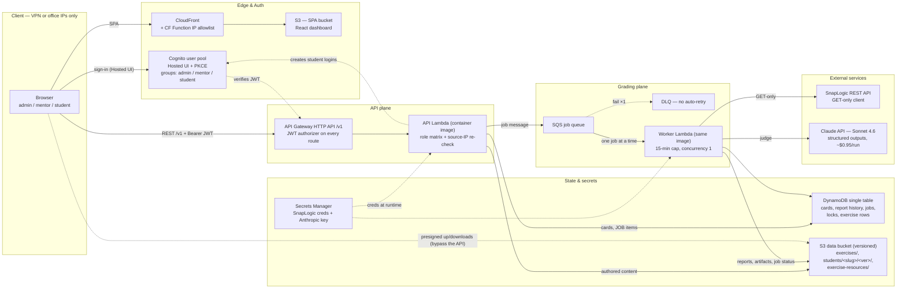

# Solution Overview — SnapLogic Exercise Evaluator

> **Audience:** a new contributor — human or AI agent — who needs to understand the
> whole system from one read. The [README](README.md) is the operating manual;
> this file is the map. Design rationale lives in
> [.claude/architecture.md](.claude/architecture.md); binding rules in
> [.claude/CLAUDE.md](.claude/CLAUDE.md) and [.claude/conventions/](.claude/conventions/).
> Last synced: 2026-07-06. A visual one-page version of this document exists as a
> Claude Artifact ("SnapLogic Exercise Evaluator — Solution Map").

## 1. What this is, in three sentences

A fully cloud-hosted grading platform for SnapLogic training exercises. Mentors
click **Grade** on a VPN-restricted web dashboard; an AWS worker Lambda runs
**deterministic hard gates** against the student's live SnapLogic project, then
sends the survivors to **Claude (Sonnet 4.6)** for judgment anchored to written
rules with explicit point values. Nothing is installed locally, a full grading
run costs about **$0.95** in Claude tokens, and the idle AWS bill is about
**$0.50–0.70/month**.

## 2. The core idea: two-layer evaluation

SnapLogic exercises admit many correct solutions, so a hand-coded rubric can't
be the judge. The system splits the work:

1. **Hard gates (deterministic Python, $0)** catch the unambiguous failures:
   wrong pipeline name, wrong output file content, missing deliverable. Cheap,
   fast, fail-closed, fully explainable.
2. **AI judgment (Claude API, paid)** handles everything that needs judgment —
   comparing the student's pipeline structure to the solution's. Crucially, the
   model may only apply deductions whose point values are **written in the rule
   files** (`exercises/general_evaluation_rules.md` + per-exercise `notes.md`).
   It never invents a value; anything the rules don't cover becomes a
   zero-point "Note". Points arithmetic and the final verdict are recomputed in
   Python — the model only proposes rule-sourced differences.

This guarantees the same mistake costs the same points for every student, and
keeps the paid AI call to the minimum surface where rules would be brittle.

### Verdicts and points

Every exercise resolves to one verdict with a 0–10 score. The per-student
denominator is always `(registered active exercises) × 10`, no matter how many
were actually graded.

| Verdict | Trigger | Points | AI judged? |
|---|---|---|---|
| **PASS** | every hard gate passed | `10 − Σ deductions`, floor 0 | yes |
| **FAIL** (output mismatch) | output content wrong, pipeline exists and ran | `10 − Σ deductions`, floor 0 — partial credit for structure | yes |
| **FAIL** (procedural) | pipeline name doesn't follow convention | 0 | no |
| **MISSING** | no runnable deliverable (no pipeline / no output / no Triggered Task) | — (counts as 0/10 in the total) | no |

## 3. Architecture

All of it is Terraform-managed (`infra/` — 12 AWS services: CloudFront, S3 ×3
buckets, Cognito, API Gateway, Lambda ×2, SQS, DynamoDB, Secrets Manager, ECR,
IAM/OIDC, CloudWatch, Budgets).

### The pieces

| Piece | Where | What it does |
|---|---|---|
| React SPA | `frontend/` (Vite + TS) | Dashboard (student rows, sortable/paginated, SnapLogic-Dashboard styling), student detail (task cards, regrade/edit buttons), exercises page (authoring, sync, file downloads). Cognito Hosted UI + PKCE login. |
| API Lambda | `backend/src/api.py` | Powertools router behind API Gateway `/v1`. Validates, enforces the role matrix and source IP, writes DynamoDB items and S3 authored content, queues jobs on SQS. Never does grading work itself. |
| Worker Lambda | `backend/src/worker.py` | SQS consumer. Runs grade and sync jobs via the `evaluator/` package. Concurrency 1; the DLQ has `maxReceiveCount 1` so a paid grade job is never auto-retried. |
| Evaluator core | `evaluator/` | Shared Python: GET-only SnapLogic client, pipeline fetch + topo sort, hard gates, AI judge (`ai_judge.py`), in-process run loop (`runner.py`), artifact/report I/O (`store.py` — LocalStore for dev, S3Store in Lambda), sync orchestrator (`sync.py`). Same code path locally and in the cloud. |
| Structured-output schemas | `schemas/` | JSON schemas Claude's structured outputs are constrained to. |
| Container image | `Dockerfile` | One image, two CMDs — API and worker. Also runs locally via `docker-compose.yml` (api/worker under Lambda RIE + a `cli` service). |
| Terraform | `infra/` | `bootstrap/` (state bucket) + `environments/production/` + 9 modules: api-gateway, sqs-worker, data-storage, cognito-auth, static-web-hosting, secrets-manager, elastic-container-registry, github-oidc, billing-budget. |
| CI/CD | `.github/workflows/` | See §7. GitHub OIDC role assumption — zero stored AWS keys. |

## 4. Data model and storage

**DynamoDB — one table** holding several item families:

- **STUDENT card** — denormalized dashboard row: name, `space` + optional
  `project` (where in SnapLogic grading looks — the card is the source of
  truth; `SNAPLOGIC_STUDENT_PROJECT_SPACE` is only the dialog default), points,
  verdict counts, `overall_summary`, optional `email` (links to a Cognito
  student login), registration stamps.
- **REPORT history rows** — one per grading run, pointing at the immutable S3
  version; scoped runs record their `tasks_scope`.
- **AUDIT rows** (`AUDIT#<ts>#<rand>`) — one immutable row per manual report
  edit (who, target, `field: from → to`, when), appended by the PATCH route and
  read back via `GET /v1/students/{slug}/report/edits` for the Edit-history
  panel. Like REPORT rows, they omit the `entity`/`slug` GSI keys so they stay
  out of list queries.
- **JOB items** — grade/sync lifecycle (queued → running → done/failed), cost
  and token usage.
- **Locks** — conditional-put, TTL 30 min, one per student/sync target.
- **EXERCISE rows** — sync state, `archived` flag, structured `task_config`
  (replaces hand-written task.json; the worker synthesizes task.json from it at
  sync time), and **tombstones** (`deleted: true`) for hard-deleted exercises
  whose folders still ship in the image (without one, the image copy would
  resurface and get re-seeded).

**S3 data bucket — the source of truth for exercise content** (July 2026
pivot). Layout:

- `exercises/<slug>/` — authored files (`description.md`, `notes.md`,
  `resources/*` — written by the API's create/edit routes) and generated sync
  artifacts (`task.json`, `solution.json`, `expected/` — written only by sync
  jobs). The repo's `exercises/` folders are a **create-only seed**: first sync
  additively copies authored files to S3, and from then on **the S3 copy wins
  everywhere** — git edits do not propagate.
- `students/<slug>/<version>/report.md|report.json` — **immutable report
  versions**; the history rows in DynamoDB index them.
- `exercise-resources/<slug>/` — lazy mirror of student input files, served to
  the browser via 5-minute presigned URLs (too big to stream through Lambda).
  Uploads also go browser → S3 directly via presigned PUT.

**Durability stack:** bucket versioning (90-day noncurrent) + DynamoDB PITR +
Terraform `prevent_destroy` + a nightly one-way snapshot of `exercises/` into
`exercises-backup/` in this repo. **Never author into `exercises-backup/`** —
it's an export. Restore = `aws s3 sync exercises-backup/ s3://<bucket>/exercises/`.

**Deletes:** *Archive* (admin) is the reversible soft delete — a flag on the
row; the worker prunes archived slugs from its working tree, S3 keeps
everything. *Hard delete* (admin, red buttons, confirm dialogs) purges every
trace: **all S3 object versions** under the entity's prefixes, all DynamoDB
rows, job rows and locks (409 while a job is in flight). Exercise deletion also
scrubs the task out of every student's **live** report (counts/points
recomputed); historical report versions are kept as the students' grading
history.

## 5. AuthN / AuthZ

- **Cognito user pool**, Hosted UI + PKCE. Three groups: `admin`, `mentor`,
  `student`. Admin/mentor users are invite-only (created in the Cognito
  console). **Student logins are created by the app**: an optional email on
  registration triggers `AdminCreateUser` into the `student` group — Cognito
  emails a temporary password; the API never handles one.
- **Three enforcement layers:** a CloudFront Function IP-allowlists the SPA at
  the edge; the API Gateway JWT authorizer rejects unauthenticated calls; the
  API Lambda re-checks source IP and enforces the role matrix (the UI only
  hides buttons — the backend is the real gate).
- **Role matrix:** admins do everything (sync, exercise authoring/archiving,
  hard deletes); mentors grade, register students, and edit evaluations
  (summary, deductions, and bonus answer);
  students are read-only **and scoped to their own grades** — a signed-in
  student lands on `/students/<own-slug>` and sees only their own card
  (`GET /v1/students` returns just that card; any other student's detail or
  reports 403s), plus exercise descriptions and file downloads. Every action
  (and `notes.md`, i.e. instructor hints) is 403'd server-side. The email
  stored on the card at registration is what links a student's login to their
  card.

## 6. Key flows

**Grade** (mentor/admin): dashboard **Grade** button → scope picker (all active
exercises preselected, or a subset) → `POST /v1/gradings` resolves the
SnapLogic location (`body override → student card → env default`), writes a JOB
item + SQS message → worker locks the student, materializes the exercise tree
(image seed ⊕ S3 overlay into `/tmp`, archived/tombstoned slugs pruned), and per
exercise: hard gates → (if judgeable) Claude with description + notes +
topo-sorted snap flows + both raw pipeline JSONs → Python recomputes points →
`report.md`/`report.json` written as a new immutable S3 version, card + JOB
updated, row refreshes live. Full runs regenerate the AI **Overall** summary;
scoped runs merge into the existing report and leave it untouched. Per-task
**Regrade** and $0 inline **evaluation editing** (PATCH — overall summary, or a
task's summary / deductions / bonus answer / points; editing deductions
recomputes that task's points as `10 − Σ` and the student total, verdict
untouched) work on the same stored report. A mentor/admin may also **override
points directly** (`points` int), which deliberately supersedes `10 − Σ` — the
one place the "same mistake = same points" invariant yields to human judgment;
it's flagged `points_manual`, allowed on any task (MISSING included), cleared by
a re-grade, and — like every edit — recorded in the AUDIT rows.

**Sync** (admin, $0 — no AI): per exercise or Sync All. The worker synthesizes
`task.json` from the row's `task_config`, fetches the solution pipeline and its
expected outputs from SnapLogic (for `triggered_task` exercises it invokes the
solution's Triggered Task once per scenario), and writes artifacts to S3. First
sync also seeds image-shipped authored files into S3. A sidecar signature keyed
off the pipeline's modified-time makes re-syncs no-ops unless the solution
changed.

**Add student** (mentor/admin): dialog takes name + project space (prefilled
from `GET /v1/config`) + optional project + optional email. The API verifies
the SnapLogic project actually exists (typo → clear 400, not a card every run
would fail on), creates the card with zero grades, and optionally the Cognito
student login (registration fails as a unit if the login can't be created).

**Exercise authoring** (admin): create/edit in the UI — description.md (first
H1 = canonical pipeline name), notes.md, task-type config, input-file uploads
via presigned PUT. Dropping a folder in git still works as a create-only
fallback; after its first sync, S3 owns it.

### The two task types

- **`file_writer`** — the pipeline writes output file(s) to SLDB; the gate
  compares column-name set + row multiset (both orders ignored;
  `columns_only` mode for non-deterministic outputs; single- or multi-output).
- **`triggered_task`** — the pipeline is exposed as a SnapLogic Triggered Task;
  grading invokes the student's task per scenario and structurally compares
  each JSON response to the cached expected one. This executes pipelines
  server-side (quota!), but stays GET-only — Triggered Task URLs accept basic
  auth on GET.

**Name matching:** pipeline names are dash-tolerant (`-`/`–`/`—` compare
equal — the SnapLogic Designer substitutes them freely); Triggered Task names
are **strict** byte-for-byte (`<pipeline name> Task`), because the invoke URL
is computed from the exact string.

## 7. CI/CD and operations

Four GitHub Actions workflows; non-secret config comes from
`.github/deploy.vars`, auth is OIDC role assumption (no stored keys):

| Workflow | Trigger | Steps |
|---|---|---|
| `deploy-backend` | backend/evaluator changes | pytest (moto AWS + stubbed Claude, $0) → docker build → push ECR → update both Lambdas |
| `deploy-frontend` | frontend changes | vitest → vite build → sync SPA bucket → CloudFront invalidation |
| `deploy-infra` | infra changes | fmt + validate → `terraform plan` (saved artifact, printed to summary) → **pause for manual approval** (`production` GitHub Environment) → apply the exact reviewed plan |
| `backup-exercises` | nightly cron | S3 `exercises/` → commit snapshot to `exercises-backup/` |

First-time deployment order (state bucket → targeted apply for ECR → manual
image push → full apply → secret value → Cognito users → deploy.vars → Sync
All) is in the README under *Cloud grading platform → Deploying*. A billing
budget alarm emails on overspend.

## 8. Local development

- **Docker is the primary runtime:** `docker compose build`, then
  `docker compose run --rm -T cli python -m evaluator.sync survey` (etc.), or
  `docker compose up api` / `run --rm worker` to exercise the Lambdas under the
  Runtime Interface Emulator. A venv is the documented escape hatch.
- `python -m evaluator run <student>` is the local twin of a cloud grade job —
  needs `ANTHROPIC_API_KEY` and **costs real money**.
- The `/prep` Claude Code skill (`.claude/skills/prep/SKILL.md`) remains the
  local dev fallback for exercise maintenance.
- `backend/tests/` (pytest + moto + stubbed Claude) and `frontend` vitest run
  at $0; both gate every PR.
- Credentials: copy `.env.example` → `.env` (SnapLogic base URL, admin creds,
  org, solution space/project, default student space).

## 9. Invariants a new contributor (or AI) must not break

1. **The SnapLogic client is GET-only by construction** — `SnapLogicClient`
   exposes no post/put/delete. Any mutation requires explicit owner approval.
2. **Never infer snap execution order from `snap_map`** — it's a UUID-keyed
   dict in insertion order. Flow order lives in `link_map`; use
   `pipeline_fetch.flow_order()` (Kahn topo sort). A real bug came from this.
3. **The AI never invents deduction values** — points come only from rules with
   explicit values; uncovered observations are $0 Notes.
4. **S3 wins over git for exercise content** — `exercises/` in the repo is a
   create-only seed; don't "fix" exercise content in git and expect it to
   deploy. Never author into `exercises-backup/`.
5. **Paid jobs never auto-retry** — worker concurrency 1, DLQ maxReceiveCount 1.
   Don't add retries around the Claude call path without thinking about cost.
6. **The points denominator is always `active exercises × 10`** — totals like
   49/90 are correct, not a bug.
7. **The backend role matrix is the security boundary** — the UI hiding a
   button is cosmetic. New routes need an entry in the matrix and (usually) a
   route in `infra/modules/api-gateway/locals.tf` + a `terraform apply`.
8. **Docs discipline:** any user-visible change updates **both** README.md and
   CHANGELOG.md in the same change ([.claude/CLAUDE.md](.claude/CLAUDE.md)).
   New conventions go in `.claude/conventions/`; API discoveries in
   `.claude/snaplogic_api_findings.md`.

## 10. Pointer map

| Question | Look in |
|---|---|
| How do I run/deploy it? | [README.md](README.md) |
| Why is it built this way? | [.claude/architecture.md](.claude/architecture.md) |
| What changed recently? | [CHANGELOG.md](CHANGELOG.md) |
| Binding rules & conventions | [.claude/CLAUDE.md](.claude/CLAUDE.md), [.claude/conventions/](.claude/conventions/) |
| SnapLogic REST gotchas | [.claude/snaplogic_api_findings.md](.claude/snaplogic_api_findings.md) |
| API routes & role matrix | `backend/src/api.py` (+ `infra/modules/api-gateway/locals.tf`) |
| Grading logic | `evaluator/runner.py`, `evaluator/hard_gates.py`, `evaluator/ai_judge.py` |
| Rule text the judge applies | `exercises/general_evaluation_rules.md`, per-exercise `notes.md` |
